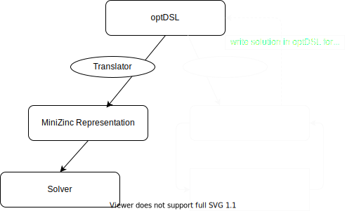
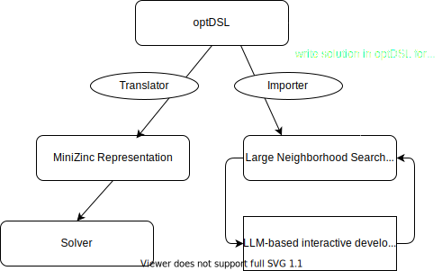
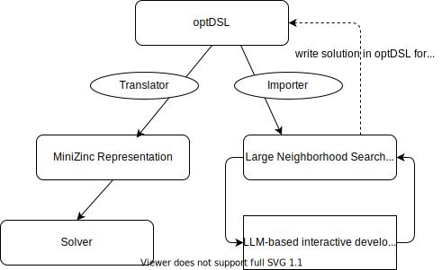
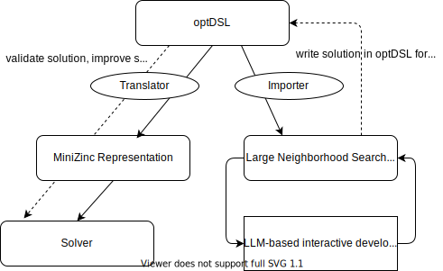

## Current State

optDSL is the shared intermediate language that connects different search worlds:

- Formal solving via MiniZinc (or other solvers)
- Metaheuristic solving via Large Neighborhood Search (LNS)

The same problem instance can be:

- translated into a formal MiniZinc model, and
- solved directly by LNS over optDSL decisions variables.

## One Instance, Multiple Solvers

::: {.r-stack}

{.fragment}

{.fragment}

{.fragment}

{.fragment}

::: 

::: {.fragment}

This closes a feedback loop between heuristic and formal optimization.

:::

## Problem Instances (WIP)

- `Two Dimensional Bin Packing`
- `Capacitated Vehicle Routing Problem`
  - Arc-based formulation
  - Giant-tour based formulation (currently not completely working)
- `Job Shop Scheduling Problem`
  - Currently not completely working
- not yet considered `Woodcutting Problem`

The same optDSL problem description file is used for MiniZinc and LNS.

## LNS Reads optDSL and Optimizes Assignments

The LNS stack works directly on optDSL decision spaces.

Capabilities:

- find feasible variable assignments
- improve objective over iterations
- use problem-specific initialization (for example CVRP, JSSP, 2DBP)

## Standard Operators Are Not Universal

LNS needs neighborhoods that fit the structure of each problem.

What this project already shows:

- generic operators (random fraction, variable blocks, sampled repair)
- permutation-safe operators for giant-tour style encodings
- problem-specific operators for CVRP and JSSP

Takeaway:

- one fixed operator set does not work equally well for all formulations.

## Interactive LLM-Based Operator Development

- This allows users to co-design operators that match a specific optDSL model.
- Operators can the be validated on problem instances
  - Quality: using MiniZinc + Solver (through "warm start" bridge)
  - Speed: LNS

## Warm Start Bridge Back to MiniZinc

LNS can export feasible incumbents as optDSL warm-start hints.

Benefit:

- heuristic search effort is reused by the formal backend.

## Conclusion and Next Steps

optDSL is the unifying layer:

- model once
- search with different paradigms
- transfer information between paradigms

This enables adaptive, hybrid optimization workflows in one consistent pipeline.

Next Steps:

- Intensive testing and evaluation on small, medium sized problems
- Woodcutting Problem
- Refinement of the implementation
- Automatic feedback loop for LLM-based operator discovery